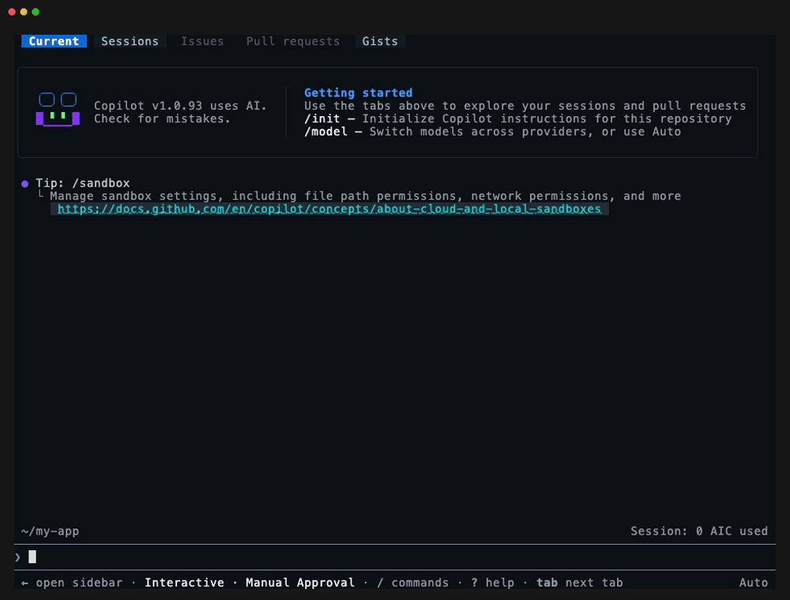
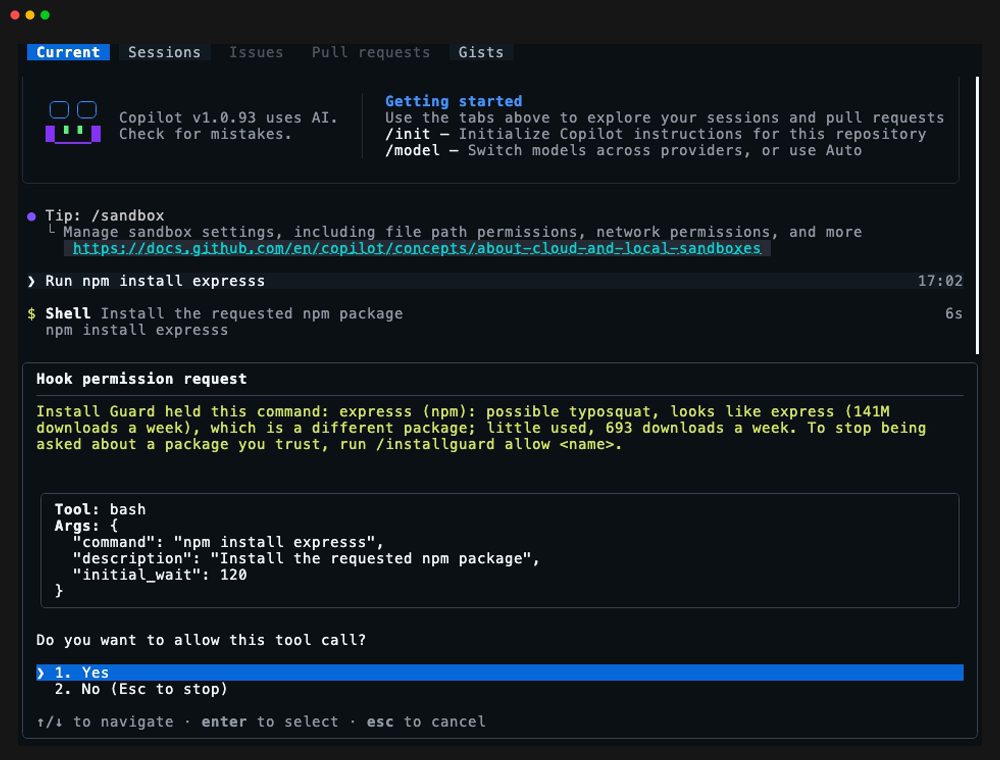

# installguard-copilot

[](https://github.com/griches/installguard-copilot)
[](https://github.com/griches/installguard-copilot/actions/workflows/ci.yml)
[](LICENSE)

**Looks up every new package before Copilot installs it.**

Install Guard for GitHub Copilot CLI. When Copilot is about to add a package your project does not already have, Install Guard asks the registry about it first. An established package goes on to Copilot's usual approval without a word. A name that does not exist, a lookalike of a popular package, a release that is hours old, or a script piped from the internet into a shell is held, and you are asked before anything runs.



Coding agents invent package names, and attackers register the names they invent. They also install whatever the newest version is, minutes after it is published. Install Guard is the check a careful person would make, made every time.

This is the Copilot CLI edition of [installguard](https://github.com/griches/installguard), the Claude Code mod. Both share one detection core.

## Install

Needs GitHub Copilot CLI 1.0.93 or later, and Node 18 or later on your `PATH`. macOS and Linux; Windows is not supported yet.

```sh
copilot plugin marketplace add griches/installguard-copilot
copilot plugin install installguard@installguard-copilot
```

Start a new Copilot session afterwards.

## What is checked

| Registry | Commands |
| --- | --- |
| npm | `npm install`, `pnpm add`, `yarn add`, `bun add`, and packages run at once by `npx`, `pnpm dlx`, `bunx` |
| PyPI | `pip install`, `python -m pip install`, `uv add`, `uv pip install`, `poetry add`, `pdm add`, `pipx`, `uvx` |
| crates.io | `cargo add`, `cargo install` |
| RubyGems | `gem install` |

Outside a registry, these are always held:

- A download piped into a shell or an interpreter: `curl … | sh`, `bash <(curl …)`, `sh -c "$(curl …)"`.
- A package from a git URL, a tarball URL or a `user/repo` shorthand.
- `pip install` from an extra index, or `npm install --registry` pointing anywhere but the public registry.
- An install whose package name comes from a shell variable, since it cannot be read.
- A Homebrew formula from a third-party tap.

## What is flagged

| Flag | Meaning | Default threshold |
| --- | --- | --- |
| Not on the registry | The name may be made up, misspelt or private. The nearest known name is suggested | |
| Lookalike | One edit, one swap or one dropped separator away from a well-known package, and not widely used itself | |
| New package | First published recently | 30 days |
| Fresh version | The version that would install is very new, or so new that no dated record of it exists yet. Most poisoned releases are pulled within days. A pinned version is checked too | 3 days |
| Release date unknown | A version you pinned whose date the registry did not give, so its age could not be checked. Shown, and held when unreachable registries are set to hold | |
| Little used | Few downloads a week | 1,000 |
| Deprecated and about to run | `npx` of a package its author has withdrawn, such as `npx tsc` without TypeScript installed | |

Shown but not held on their own: a package that runs an install script, a Python package that ships source only, a deprecated package.

## What is never asked about

- A bare `npm install`, `npm ci` or `pip install -r requirements.txt`: the lockfile or the file is your project's own.
- A package already in `package.json`, `requirements.txt`, `pyproject.toml`, `Cargo.toml` or the `Gemfile`.
- `npx` of something already in `node_modules/.bin`.
- A local path or a workspace package.
- A package you chose to always allow.

## What you see

**Nothing flagged:** nothing. The command goes on to Copilot's own approval, exactly as it would without Install Guard. Install Guard never approves a command for you.

**Something flagged:** Copilot shows a "Hook permission request" with what was found, and Yes or No. Choose No and the command is not run; Copilot is told why.



**Nobody to ask** (`copilot -p`, the cloud agent): a held command is refused, and Copilot is told why.

## Commands

| Command | What it does |
| --- | --- |
| `/installguard` | What was checked lately, and the allowed list |
| `/installguard check <name>` | Look a package up without installing it. `pypi:<name>`, `crates:<name>` and `rubygems:<name>` for the other registries |
| `/installguard allow <name>` | Always allow a package. Install Guard asks you to confirm, since the list is yours to change and not Copilot's |
| `/installguard forget` | Clear the allowed list |

## Settings

Optional, in `~/.copilot/installguard/config.json`:

```json
{ "hold": "flagged", "sensitivity": "balanced", "unreachable": "allow", "onHold": "ask" }
```

| Setting | Default | What it does |
| --- | --- | --- |
| `hold` | `flagged` | `always`: every command that adds a package the project does not have |
| `sensitivity` | `balanced` | `relaxed`: 7 days, 1 day, 100 downloads a week. `strict`: 90 days, 7 days, 10,000 |
| `unreachable` | `allow` | `hold`: a command whose registry cannot be reached waits for your answer |
| `onHold` | `ask` | `deny`: a held command is refused outright instead of asked about |

## Limits

- It reads the command line. A package pulled in as a dependency of the one you named is not looked up.
- A package named through a shell variable (`npm install $PKG`) cannot be read, so the command is held for your answer.
- It watches commands, not files. A dependency Copilot writes into `package.json` and then installs with a bare `npm install` is not looked up.
- Popularity on RubyGems is not judged, since RubyGems publishes a total and not a rate.
- A private package is "not on the registry" as far as the public registry knows. Run `/installguard allow <name>` once.
- It is a second look, not a scanner: it does not read the package's code.
- Without Node on the `PATH` it checks nothing, and commands go on to Copilot's own approval.
- Copilot's prompt has Yes and No only, so there is no "always allow" button: use `/installguard allow <name>`.

## What it does on your machine

Install Guard is a Copilot CLI plugin made of two hooks and one command. This is everything it does.

**It runs before each tool call.** `scripts/pre-tool-use.sh` reads the tool call Copilot is about to make. Unless it carries a shell command, the script ends there. Otherwise it runs `dist/hook.mjs` with Node, which reads the text of the command. A command that adds no new package is passed on untouched. It never changes a command, and it never approves one.

**It reads five files in your project folder**, to learn which packages you already depend on: `package.json`, `requirements.txt`, `pyproject.toml`, `Cargo.toml` and `Gemfile`. It also checks whether `node_modules/.bin/<name>` exists. Nothing from these files leaves your machine.

**It asks a public registry about a package, by name.** These are the only hosts it contacts, and the package's name and version are the only things it sends:

| Host | Asked for |
| --- | --- |
| `registry.npmjs.org` | An npm package's version, publish dates, install scripts and deprecation |
| `api.npmjs.org` | An npm package's weekly downloads |
| `pypi.org` | A PyPI package's releases and their dates |
| `pypistats.org` | A PyPI package's weekly downloads |
| `crates.io` | A crate's versions, dates and recent downloads |
| `rubygems.org` | A gem's versions and dates |
| `api.deps.dev` | The publish date of one npm version you pinned, when the package is too large to ask npm for it |

It sends no part of your conversation, your code, your files or the command itself. The full statement is in [PRIVACY.md](PRIVACY.md). It has no account, no telemetry and no server of its own, and it calls no model.

**It can have a command held or refused.** It answers Copilot with `ask` (or `deny`, if you set `onHold`), and Copilot does the asking.

**It keeps four small files** in `~/.copilot/installguard/`: `allowed.json` (packages you always allow), `log.jsonl` (the last few hundred checks, with the command text), `config.json` if you write one, and `root` (where the plugin is installed, written at session start so `/installguard` can find its program).

**It adds** the `/installguard` command, which has Copilot run `dist/cli.mjs` with Node. It adds no tools for the model.

## Security

A command is read wherever it stands: after `cd … &&`, inside `bash -c "…"` or `eval`, behind `sudo` or `env`, and after a here-document.

Copilot lets a hook that runs out of time pass, so Install Guard gives the registries 20 of its 30 seconds and holds the command itself if they have not answered. If the guard fails on a command that fetches a package, the command is held for your answer. A command or file edit that would change the allowed list is held too.

It is a guard against mistakes, not a sandbox: it reads what a command says, and a command written to hide what it fetches can get past it.

Found a way past it? Open an issue, or for anything sensitive use GitHub's private vulnerability reporting on this repository.

## Development

Needs [Bun](https://bun.sh) to build and test. `dist/` is committed, since a plugin is installed by cloning the repository and nothing is built on install.

```sh
bun install
bun run build       # src/ -> dist/hook.mjs, dist/cli.mjs
bun test
bun run typecheck
copilot --plugin-dir .
```

`src/core/` and `tests/core.test.ts` are copied from [installguard](https://github.com/griches/installguard), where they are written. `bun run sync` copies them again from a checkout beside this one.

## Licence

MIT. See [LICENSE](LICENSE).
